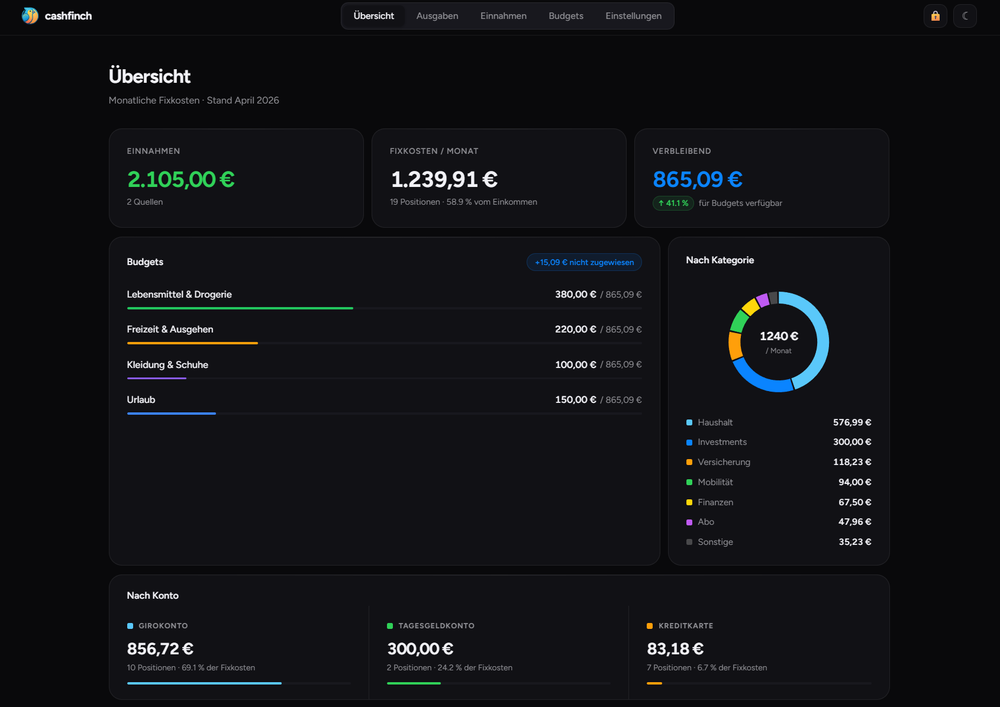

<div align="center">


# cashfinch

**Persönlicher Finanz-Überblick · lokal · verschlüsselt · kostenlos**

[](https://nodejs.org)
[](https://react.dev)
[](LICENSE)
[](https://github.com)

</div>

---

cashfinch ist eine schlanke Web-App für den persönlichen Finanzüberblick – **komplett lokal auf deinem Rechner**, ohne Cloud, ohne Abo, ohne Datenweitergabe. Deine Finanzdaten werden mit **AES-256-GCM** verschlüsselt und liegen nur auf deiner Festplatte.

> **Ideal für:** Fixkosten im Blick behalten, Budgets planen, monatliche Ausgaben analysieren.

---

## ✨ Features

- **Dashboard** – Übersicht über Einnahmen, Ausgaben und den verbleibenden Betrag auf einen Blick
- **Donut-Chart** – Visuelle Aufteilung der Ausgaben nach Kategorien
- **Wiederkehrende Ausgaben** – Monatlich, quartalsweise und jährlich (automatisch auf Monatsbetrag umgerechnet)
- **Budgets** – Frei definierbare Budgettöpfe mit Fortschrittsanzeige
- **Konten & Kategorien** – Vollständig anpassbar, per Drag & Drop sortierbar
- **AES-256-GCM Verschlüsselung** – Alle Daten passwortgeschützt, Key nur im RAM
- **Dark & Light Mode** – Minimalistisches Apple-inspiriertes Design
- **Kein Abo, keine Cloud** – Daten liegen als JSON-Dateien lokal (auch NAS / Dropbox möglich)

---

## 📸 Screenshots

<!-- Screenshots einfügen, z.B.: -->
<!--  -->

*Screenshots folgen – starte die App und mach selbst welche!*

---

## ⚙️ Voraussetzungen

Nur **Node.js** wird benötigt (Version 18 oder neuer):

- [Node.js herunterladen](https://nodejs.org) → LTS-Version wählen

Prüfen ob Node.js installiert ist:
```bash
node --version
# v20.x.x
```

---

## 🚀 Installation & Start

### Windows

1. Repository herunterladen (grüner **Code**-Button → **Download ZIP**) oder klonen:
   ```bash
   git clone https://github.com/DEIN_USERNAME/cashfinch.git
   ```
2. In den Ordner wechseln und `start.bat` doppelklicken

```
📁 cashfinch/
└── start.bat  ← Doppelklick!
```

Der Browser öffnet sich automatisch unter `http://localhost:5173`.
Beim ersten Start werden alle Abhängigkeiten automatisch installiert.

---

### macOS / Linux

```bash
git clone https://github.com/DEIN_USERNAME/cashfinch.git
cd cashfinch
chmod +x start.sh
./start.sh
```

---

### Manuell (alle Systeme)

```bash
git clone https://github.com/DEIN_USERNAME/cashfinch.git
cd cashfinch
npm install
npm run dev
```

---

## 🔑 Erste Schritte

1. **Passwort einrichten** – Beim ersten Start wird ein Passwort für die Datenverschlüsselung festgelegt. Dieses Passwort gibt es keine Wiederherstellung – bitte gut merken!
2. **Onboarding** – Ein geführter Einrichtungsassistent hilft dir dabei:
   - Einnahmen eintragen
   - Konten & Kategorien anpassen
   - Ausgaben & Budgets anlegen
3. **Fertig!** – Das Dashboard zeigt sofort deinen monatlichen Überblick.

---

## 🗂️ Datenspeicherung

Alle Daten werden lokal im Ordner `data/` als verschlüsselte JSON-Dateien gespeichert.

```
data/
├── einnahmen.json    ← Einkommensquellen
├── ausgaben.json     ← Wiederkehrende Ausgaben
├── budgets.json      ← Budget-Definitionen
├── konten.json       ← Kontonamen
└── kategorien.json   ← Ausgabe-Kategorien
```

**Alternativer Datenpfad** (z.B. für Dropbox oder NAS): In `config.json` den Schlüssel `datenpfad` auf den gewünschten Ordner setzen.

> ⚠️ Die Datei `config.json` und alle Dateien in `data/` sind in `.gitignore` eingetragen und werden **nicht** mit Git eingecheckt.

---

## 🔐 Sicherheit & Verschlüsselung

| Komponente | Details |
|------------|---------|
| Algorithmus | AES-256-GCM (authentifiziert) |
| Schlüsselableitung | scrypt (N=16384, r=8, p=1) |
| Key-Speicherung | Ausschließlich im RAM – nie auf der Festplatte |
| Salt & Verifier | In `config.json` gespeichert (kein Klartext) |
| Passwort-Minimum | 4 Zeichen |

Das Passwort wird **nicht gespeichert**. Bei Verlust sind die Daten nicht mehr lesbar.

---

## 🛠️ Tech Stack

| Bereich | Technologie |
|---------|-------------|
| Frontend | React 19 + Vite 8 |
| Styling | Tailwind CSS v4 |
| Charts | Recharts |
| Backend | Express.js 5 |
| Datenspeicherung | JSON-Dateien (lokal) |
| Verschlüsselung | Node.js `crypto` (AES-256-GCM) |

---

## 🗺️ NPM Scripts

| Script | Beschreibung |
|--------|-------------|
| `npm run dev` | Entwicklungsmodus (Server + Frontend mit Hot Reload) |
| `npm run build` | Frontend für Produktion bauen |
| `npm start` | Produktionsmodus (nach `build`) |

---

## 📄 Lizenz

MIT – frei zu verwenden, modifizieren und weiterzugeben.
Siehe [LICENSE](LICENSE).

---

<div align="center">

**cashfinch** · lokal · verschlüsselt · Open Source

</div>
